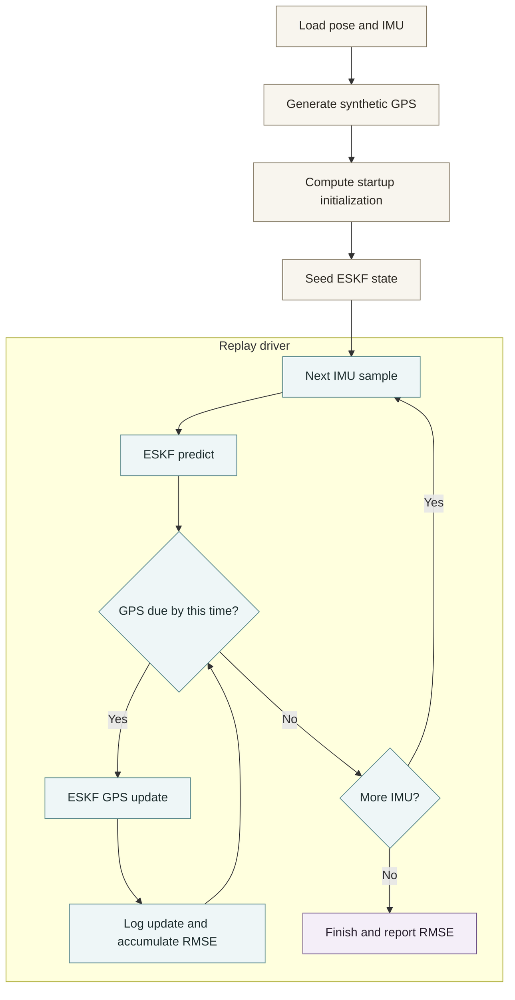

# ESKF Flow

```mermaid
flowchart TD
    A[Load pose and IMU] --> B[Generate synthetic GPS]
    B --> C[Compute startup initialization]
    C --> D[Seed ESKF state]

    subgraph Replay["Replay driver"]
        E[Next IMU sample] --> F[ESKF predict]
        F --> G{GPS due by this time?}
        G -- No --> H{More IMU?}
        G -- Yes --> I[ESKF GPS update]
        I --> J[Log update and accumulate RMSE]
        J --> G
        H -- Yes --> E
        H -- No --> K[Finish and report RMSE]
    end

    D --> E

    classDef prep fill:#f8f5ee,stroke:#8a7f6b,color:#2d2922;
    classDef flow fill:#eef6f7,stroke:#5e8c8f,color:#1f2f30;
    classDef result fill:#f4eef8,stroke:#7a5f8f,color:#2a2130;

    class A,B,C,D prep;
    class E,F,G,H,I,J flow;
    class K result;
```
