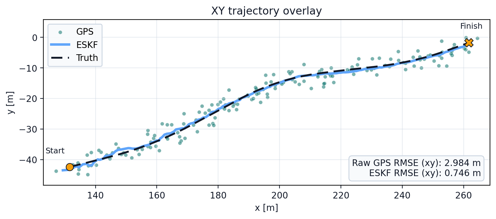

# IMU/GPS Error-State Kalman Filter

[](https://github.com/jreich218/imu-gps-eskf/actions/workflows/ci.yml)

This C++/Eigen IMU/GPS ESKF baseline for ego-state estimation can run on bundled simulated data in `scenarios` or on user-downloaded nuScenes CAN-bus data.

For nuScenes CAN-bus inputs, the documented operating set for this project is the `876` scene IDs listed in `metadata/supported_nuscenes_scenes.txt`.

The trajectory for the run on the bundled data is shown below.



## What is in this repo

- A C++ ESKF over position, velocity, and attitude.
- Synthetic 2D GPS generation from pose data.
- Startup initialization from early IMU and synthetic GPS samples.
- A bundled pose/IMU pair so the app runs out of the box, plus support for a single matching nuScenes scene with pose, IMU, and wheel-speed inputs.
- Unit tests and an end-to-end integration test.

## Project docs

- [Overview](https://jasonmreich.com/eskf_docs/)
- [Inputs](https://jasonmreich.com/eskf_docs/inputs/)
- [Synthetic GPS](https://jasonmreich.com/eskf_docs/synthetic_gps/)
- [Initialization](https://jasonmreich.com/eskf_docs/initialization/)
- [ESKF](https://jasonmreich.com/eskf_docs/eskf/)
- [Outputs](https://jasonmreich.com/eskf_docs/outputs/)
- [API](https://jasonmreich.com/eskf_docs/api/)

## Supported inputs

If you'd like to use the bundled simulated pair, the project can be built and run as is.

This repo supports the bundled `scene_pose.json` / `scene_ms_imu.json` pair and a documented subset of nuScenes CAN-bus scenes from the February 2020 release. No nuScenes data is shipped here.

For a supported nuScenes scene, the required files are `scene-XXXX_pose.json`, `scene-XXXX_ms_imu.json`, and `scene-XXXX_zoe_veh_info.json`.

The supported nuScenes operating set is the `876` scene IDs listed in `metadata/supported_nuscenes_scenes.txt`.

That manifest was produced from the current app behavior and the offline post-pruning procedure described on [Inputs](https://jasonmreich.com/eskf_docs/inputs/).

If exactly one matching nuScenes pose/IMU pair is present under `scenarios/`, the app uses that scene and loads the matching `scene-XXXX_zoe_veh_info.json`. Otherwise it uses the bundled pair.

The app does not check scene membership at runtime. You are expected to supply only scene IDs from the supported-scene manifest.

See [Inputs](https://jasonmreich.com/eskf_docs/inputs/) for details on filenames, runtime selection, schemas, and time properties.

## Build and run

Start here:

```bash
git clone https://github.com/jreich218/imu-gps-eskf.git
cd imu-gps-eskf
```

The local package-install commands below assume Debian or Ubuntu.

### 1. Build locally

```bash
sudo apt-get update
sudo apt-get install -y cmake g++ libeigen3-dev nlohmann-json3-dev libgtest-dev
```

Run this from the repo root:

```bash
./dev.sh
```

`./dev.sh` configures the build, builds the app, runs the test suite, and then launches the app.

### 2. Build in a dev container

Install what this path needs on the host:

- Docker
- Visual Studio Code
- the Dev Containers extension for Visual Studio Code

Open the cloned folder in Visual Studio Code, then run `Dev Containers: Reopen in Container`.

Once the container opens, run these from the repo root inside the container.
Visual Studio Code should open the terminal there automatically.

```bash
./dev.sh
```

## Output

- The main output is `output/eskf_sim_log.csv`. Each row is one GPS update. It records the timestamp, the filter position estimate, the GPS measurement, the reference pose, the GPS innovation, the NIS, and the resulting position error so you can inspect how the filter behaved over the run.
- The app also prints a short run summary to stdout, including the number of GPS updates and the xy RMSE for raw GPS and for the ESKF.
- The app creates and uses synthetic GPS data at runtime from the selected pose stream. The generated samples are written to `output/gps.json` for optional inspection.
- `scripts/plot_xy.py` reads `output/eskf_sim_log.csv` and writes `assets/xy_trajectory.png`.

## Disclaimers

- This project and its docs were written in collaboration with ChatGPT.
- This repository is an educational demo only, it is not for safety-critical use.
- This project is not affiliated with, endorsed by, or sponsored by nuScenes or Motional.
- No nuScenes/Motional data or content is included or redistributed here.
- A Python simulation was built to create synthetic data for this project. The synthetic data is included in `scenarios` and is sufficient for running all of the code in this repo.
